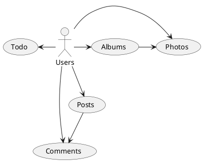

# json_placeholder

## Backend

We well use [JsonPlaceholder](https://jsonplaceholder.typicode.com) as Api for our application

### Models relations

## Packages

- dio: Api request
- bloc: state management
- qlevar_router: navigation

## Project structure

- Routes
- Services
  - UsersServices
  - PostsServices (Posts & Comments)
  - AlbumsServices (Albums & Photos)
  - TodoService
- Widgets
- Models
- Pages
  - Home (Posts & Comments count)
    - bloc
    - View
  - Post (Post & Comments)
    - bloc
    - View
  - User (Info & Albums & Posts)
    - bloc
    - View
    - Albums (Photos)
      - bloc
      - View
    - Todo
      - bloc
      - View
